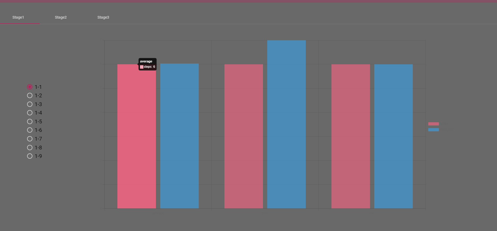
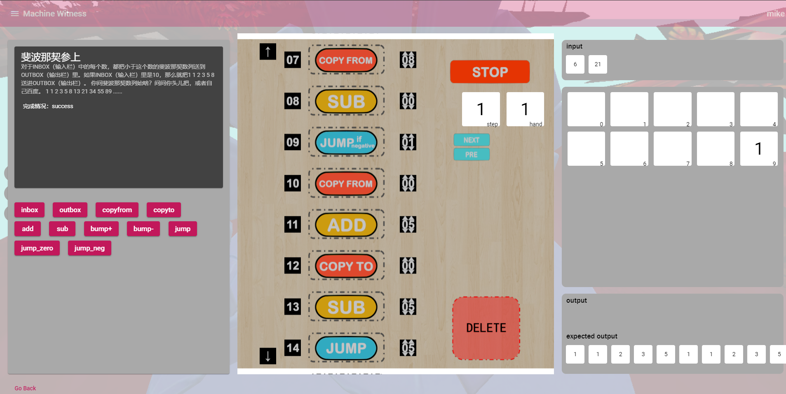

# PJ文档

PJ完成了一个可以供多人探索的世界，由三个分开的地图组成。在每个地图中，玩家可以找到一些不需要写代码的编程问题，并且也可以在地图上留下自己的问题供他人解答。

第一阶段中我们完成了如下的内容：

- 注册与登录
- 后端安全
- 用户形象的选择
- 模型的运动
- 多人场景的同步
- docker的部署

在PJ的最终完成版本中，我们在第一阶段的基础上又完成了如下的内容：

- 编程问题的逻辑
- 对复杂3D场景的加载
- 用户自定义编程问题功能
- 聊天室
- 用户后台与管理员后台图表展示

## git

使用github进行团队协作，以下为代码的github仓库：

- 前端

  https://github.com/WEB3D-TEAM/Frontend

- 后端

  https://github.com/WEB3D-TEAM/Backend

- socket

  https://github.com/WEB3D-TEAM/Socketend

## 架构设计

项目由三个主要的部分组成：前端、后端、nodejs+socketio。其中第三个部分只由一个文件index.js构成，写入了WebSocket与前端的交互逻辑。下面介绍前端与后端以及其对应的功能模块，并且说明三个部分是如何进行互相调用的。

- 前端 -- angular + angular material + three.js + ng2-chart

  

  在前端部分中，angular组件可以分成两大类：

  - 一大类是负责用户进行3D场景游玩时与用户交互的组件，罗列在了右侧。右侧中两个组件涉及到three.js的api调用，即world组件与problem组件，前者负责容纳当前所有的玩家并对他们的行为做出同步，后者则是每一个玩家独立在problem界面中进行编程操作。
  - 另一大类是纯负责业务逻辑的组件，罗列在了左侧。其中admin组件与user-center组件分别对应了需求中的两个后台页面，admin组件会展示所有地图的解题情况。而user-center组件会展示每一个用户自己的解题记录，并且提供修改密码、信息查看等简单功能。
  - 上述的业务逻辑组件主要使用了angular material实现。

  

  上图详细阐释了两个three.js组件中涉及到的相关部分，可以看到尽管主要部分是three.js，但仍然混合了一部分angular的组件来方便用户的体验。真正使用到three.js的代码均写在两个renderer-开头的文件中，这个文件中包含或调用其他文件的mesh、light或camera等元素。

- 后端 -- springboot + spring security + hibernate + jpa repositiory + mysql

  

  后端可以分成三个主要的部分：安全模块、controllers和services：

  - 在安全模块中，我们使用Jwt对用户进行身份验证，并使用Spring Security对每一个api进行权限控制，例如admin组件所调用的api普通用户就无法访问。
  - controller的接口在各个模块交互部分介绍。
  - service中一个很重要的负责部分是无代码编程的逻辑实现以及编程问题信息的存取。为了保证系统的安全性，我们将解题逻辑放在了后端实现。如果将编程逻辑放在前端，那么用户很容易绕过它来直接访问后端接口而直接完成解题。除此之外，service为用户提供注册、登录等基本的功能，并且提供一些问题相关的服务，例如问题信息的查询以及后台数据的查询。

- 各个模块之间的交互过程

  
  
  上图罗列出了一些主要的的交互流程，这些流程在两组模块之间进行：前端与后端、前端与socketio：
  
  - 在前端后端交互中，我们将其分为四个大类：登陆注册、用户中心功能、用户查询问题与解题功能、管理员查看后台图表化数据功能】
  - 在前端与socketio的交互中，有三个事件需要监听并广播给当前地图对应的房间：用户移动、用户交流以及用户在地图内留下一个问题。
  
  这里需要注意的是，在用户自定义问题时，前端与两个模块都有交互，是因为我们既需要将这份新问题信息保存到数据库中，以便后来登入的玩家查看并且记录后续相关的解题数据，又需要让当前处在房间中、没有刷新页面去调用后端api的用户知道当前房间中有人建立了新问题。

## 前端主要界面及其实现细节

- three.js实现

  由于three.js的实现过程非常容易让代码紧耦合，即把许多内容都写在少数的文件中，我们以地图的实现为例来阐述代码的可扩展性：

  ```html
  <three-renderer>
      <three-scene *ngIf="mapId === 'camp'">
          <three-light mode="hemi" [position]="[0, 50, 0]"></three-light>
          <three-light mode="dir" [position]="[-1, 2, 1]"></three-light>
          <three-light mode="ambient" [position]="[0, 0, 0]"></three-light>
          <three-floor [position]="[0, -70, 0]" [color]="'0x00ebc0'"></three-floor>
      </three-scene>
  </three-renderer>
  ```

  我们先声明一个抽象类AbstractObjectDirective，将其声明为一个angular directive（这一个组件原本的用途是方便样式的开发），随后让scene、light与floor等Object3D对象均继承自这个抽象类。抽象类的实现方式如下：

  ```typescript
  @Directive({
    selector: 'appAbstractObject'
  })
  export class AbstractObjectDirective<T extends Object3D> implements AfterViewInit {
    public object!: T;
    @Input() position: number[] = [0,0,0];
  
    @ContentChildren(AbstractObjectDirective, { descendants: true })
    childNodes!: QueryList<AbstractObjectDirective<any>>;
  
    constructor() { }
  
    // add child nodes
    ngAfterViewInit(): void {
      if (this.childNodes && this.childNodes.length > 1) {
        this.object.add(...this.childNodes
          .filter(node => node !== this && node.object !== undefined)
          .map(({ object }) => object));
      }
      this.object.position.set(this.position[0], this.position[1], this.position[2]);
    }
  }
  ```

  考虑到每一个Object3D都需要一个position，因此使用属性绑定的方式让父组件直接给每个Object3D传值，并且每个Object3D可以使用ContentChildren的方式来从html结构中获得它的子元素，例如上述的scene中就包含了三个light与一个floor的Object3D对象。我们在ngAfterViewInit方法中把子元素全部添加到当前的节点中，这样就实现了代码的松耦合。

- 3D场景

  除开灯光、相机等基本Object3D对象，场景的主要构成为玩家（自己与其他人）、地图、进入问题界面的传送门。

  对于地图来说，我们使用了sketchfab上公开的模型来搭建自己的场景，并且总共设置了三个地图：camp、island与forest，在导航栏中可以看到。

  - camp

    

  - island

    

  - forest

    

  在这些地图中，编程问题的难度依次上升，并且每个地图内部的问题会按照玩家发现他们的顺序而循序渐进地增加难度。

  对于玩家，我们设置了走路与停止的动画切换，使运动显示更为自然，并且使用CANNON.js物理引擎框架来实现模型的坐标移动，这会在后面的加分部分中详细阐述。

  对于传送门，我们也使用了CANNON.js的raycaster将玩家的bounding box与传送门的bounding box作求交计算，从而进入到每个传送门所对应的问题界面中，当然这些问题的数据都是在初次加载地图时从后端所获取到的。我们在进入传送门之前，会显示一个当前问题的以往解题记录供玩家查看，玩家可以看到这个问题的总共解决次数、解决的步骤以及所使用的指令数目来作为一个参考：

  

- 问题界面

  这一部分包含了我们PJ的核心玩法，即使用无代码的方式来进行编程，解决我们预设的或者其他玩家所设定的编程问题，具体的操作说明详见文件夹下的操作说明文档。

  我们以一个camp地图中最简单的问题1-1来说明问题界面：

  

  左上角是问题的标题、任务描述以及完成情况，这个面板下面有一个inbox与outbox，分别表示从input序列中获取一个值放到手上，以及把手上的东西放到output序列中。如果我们生成的output序列和expected output序列完全一致，那么就表明我们解题成功。可以看到对于三个input方块，我们需要分别进行三次inbox和outbox：

  

  随后点击运行我们会向后端发送一个请求，请求里包含了玩家所使用的指令序列，后端在完成计算之后会告诉我们是否成功，以及每一个指令步骤所对应的执行情况，玩家可以在点击run之后通过新的按钮进行观察：

  

  当运行到第三步时，我们已经执行完了第二个inbox，此时手上是8，output里面已经通过outbox放进去了一个3，然后input还剩下1。

  在后续的加分部分中，我们会介绍非常复杂的编程问题。

  在具体实现上，我们依然使用three.js来实现问题场景，我们使用三维的场景并固定camera来获取一个二维的平面，其中的instruction也是使用上述directive的方式加入到html标签中，来做到较好的可扩展性。对于每一个指令标签，我们需要获取它的图片并进行渲染。我们总共支持11种指令，这些指令包括了最为基本的inbox、outbox、从临时的内存空间种拷贝或获取的指令、jump的跳转指令、加、减等运算操作。

  除此之外，在具体的操作过程中，我们使用了three.js所提供的raycaster的api来进行与场景的求交运算，从而知道用户当前正在拖拽哪一个指令以及是否将它放到了删除区域，或者是是否点击了一些按钮来进行运行、停止、下一步与上一步的类似于debug的状态观察。

- 个人中心后台

  在这一部分中，我们为用户提供了三个服务：查看自己的个人信息、修改自己的密码、查看自己以往的做题记录，我们主要介绍第三个功能：

  

  用户可以看到自己对于每一个已经完成的题目的总共步骤数量、使用的指令数，以及具体的指令编排。这一个界面对应了用户的个人后台记录。在实现上，我们使用了angular material包所提供的mat-table组件，并传入后端所发送的列表数据。

- 手册、用户自定义问题与聊天窗口

  这三个均以侧边栏的形式展示：

  

  在聊天窗口里用户可以看到当前地图的其他人（不同地图的用户处于不同的房间），并进行聊天：

  

  在自定义问题界面，组件会监控用户的当前位置，并提供当前地图内置问题的所有指令供用户选择（在后续地图中出现的指令多而复杂，因此不在前面的地图中供用户选择），并且在用户提交时在当前位置留下一个新问题的传送门：

  

  这个方块表示刚刚新创建的问题。

## 后端实现细节

- 后端实现了用户的登陆注册，查看个人解题情况以及用户查看、解决、自定义题目等功能。详细接口如下：

  用户方法在AuthController接受请求，然后传入UserService或AuthService中执行相应验证信息，存入仓库或错误提示操作。

  /register:用户注册，主要为用户注册信息的验证和存储。

  /login:用户登录，主要为登录信息的验证，通过AuthenticManager验证登录并返回token。

  /changePassword:用户修改密码，根据token获取用户名，验证密码格式并修改。

  /center:用户中心，根据用户token查看个人信息，解题情况等。

  /admin/center:管理员中心，管理员查看用户数量以及解题情况。

- 题目方法在ProblemController中接受请求，然后传入ProblemService中执行题目的查询，解决，定义等操作。

  /problem:根据stage和number返回对应的题目。

  /mapProblems:根据用户token，查看对应stage解题情况，

  /userDefine:用户自定义问题，并存入仓库。

  /solve:用户解决问题，根据对应的stage和number以及用户提供的答案进行验证，返回解决情况。

- 解题逻辑的实现：在Utils.execInstruction中，需要根据用户输入的命令进行模拟，并将实际输出与答案进行比对。首先比对用户使用的命令是否在可用命令中，然后用字符串数组memory表示运行内存，字符串hand表示处理器中的值，整数inst_index表示下一步要执行的命令，然后在循环中根据不同的命令执行对应操作。在每次产生输出是与答案进行比对，在操作错误或答案错误时跳出循环并产生相应错误信息存入statusList中。statusList用来保存每一步执行的情况，如剩余输入，当前输出，处理器、内存情况等，其最后一项未该次执行的状态信息，执行成功或对应的错误信息。

- 一些对解题的测试用例：

  

  

  对题目的解题逻辑进行了测试，首先模拟用户登录，然后根据对应题目创建答案，最后查看StatusList，发现最后两个状态输出与答案项目，最后状态信息成功，结果符合预期。

## 文件结构

### 前端


除开services文件夹之外，每一个均代表了一个angular组件，其中由html、css、typescript组成：

- admin-管理员后台图表
- chat-聊天组件
- craft-用户自定义问题组件
- dialog-提示框组件
- login-登录表单
- manual-用户手册组件
- nav-导航栏
- page-not-found-404页面
- register-注册组件
- solution-table-用户中心里的后台数据
- table-dialog-进入题目之前查看的完成情况
- user-center-用户中心

services：


- auth.interceptor-给每个请求加上Authorization：token头部
- auth.service-前端组件与后端交互
- data.service-组件数据共享
- player.service-前端与socket端同步
- problem-backend.service-前端问题界面与后端交互

world，three.js部分：


- basics：Object3D的directive基类、光照、scene
- entity：地图、玩家（自己与其他玩家，都继承自玩家抽象类）
- mesh：一些场景中的基本mesh
- problem：问题界面组件以及对应的渲染器
- world：场景界面组件以及对应的渲染器

### 后端


- CorsConfig-处理跨域请求
- controller-注册登录、后台信息、问题处理接口
- domain、repository-hibernate实现的类与持久化层
- security-spring security与jwt验权
- service-注册登录、后台信息、问题处理服务

### nodejs + socketio

这一个模块只使用了一个文件，进行WebSocket服务端的操作：

- index.js

## 加分内容

1. 使用ng-chart2的图表组件实现了管理员对后台数据的查看

   管理员在登入后，可以查看每一个stage中的每一个问题的完成情况，红色柱状图表示完成时使用的步骤数，蓝色柱状图表示所使用的指令个数，管理员可以将鼠标悬停到柱子上查看具体信息。

   

   左侧一列表示所有解题记录的平均值、中间表示最大值、右侧表示最小值。一般来说所使用的步骤数与指令数越少越好，但某些情况下更多的指令可以换取更少的步骤，例如将jump替换为指令的重复就可以减少一个jump指令的使用。实现如下：

   ```html
   <div class="chart">
       <canvas baseChart
               [datasets]="statMap[selected[i]]"
               [labels]="labels"
               [options]="options"
               [legend]="true"
               [type]="'bar'"></canvas>
   </div>
   ```

   我们使用ngModel实现radio按钮的数据双向绑定，并且在图表中展示被选中的那个问题的值。

2. 使用CANNON.js框架实现了简单的物理机制

   下面为CANNON.js刚体的可视化显示，我们手动地为用户以及场景上的各个物体添加了一个bounding box。来起到一个较好的障碍物阻挡效果：

   

   在使用CANNON.js时，其中的基本元素是world与body，分别对应着three.js的scene与mesh。在这个物理引擎框架中，我们只要在每一帧进行world.step()操作，CANNON.js就能自动地帮我们计算每一帧各个body的位置。因此能比较好地处理下坠、碰撞等刚体之间的相互作用。

   在用户步行时，我们给刚体添加一个速度，让它在地面上滑行，同时在每一帧根据刚体的位置来更新模型的位置。通过这个方法，我们能实现模型的运动，同时让模型在遇到一些障碍物、空气墙时停止。下面为走路的关键代码，我们用每一帧累加的方式改变body的速度，避免刚体速度突变使效果不好。

   ```typescript
   this.model.position.x = this.body.position.x;
   this.model.position.y = this.body.position.y - 7;
   this.model.position.z = this.body.position.z;
   
   this.velocity.x = 0;
   this.velocity.z = 0;
   
   if (this.activeAction === 'walk') {
       let vX = -this.walkDir.x * 50;
       let vZ = -this.walkDir.z * 50;
       if (Math.abs(this.velocity.x) < 50 || (vX * this.velocity.x < 0)) {
           this.velocity.x += vX;
       }
       if (Math.abs(this.velocity.z) < 50 || (vZ * this.velocity.z < 0)) {
           this.velocity.z += vZ;
       }
   }
   ```

3. 实现了鲁棒性强、功能较为完整的无代码编程模式，并且一些题目的难度与复杂性均较高

   这个问题中我们对input中的每一个数要输出小于它的斐波那契数列，这个问题是相对来说比较复杂的。可以看到后端计算出结果为成功，说明程序正确运行。
   
   

## 部署细节

项目在腾讯云的轻量级服务器上进行部署，服务器系统为linux宝塔，版本号7.8.0。

服务器系统配置为：*Linux VM-4-9-centos 3.10.0-1160.49.1.el7.x86_64 #1 SMP Tue Nov 30 15:51:32 UTC 2021 x86_64 x86_64 x86_64 GNU/Linux*

项目在上述系统的docker中部署。

- 前端

  dockerfile：

  ```dockerfile
  FROM nginx:latest
  COPY /dist/machine-witness /usr/share/nginx/html
  EXPOSE 81
  ```

  bash：

  ```bash
  # angular build
  ng build
  
  docker build -t machine-front .
  docker run --name machine-front -p 81:80 -d machine-front
  ```

- 后端

  dockerfile：

  ```dockerfile
  FROM openjdk:8
  ADD target/MachineBack.jar MachineBack.jar
  EXPOSE 8080 9091
  ENTRYPOINT ["java", "-jar", "MachineBack.jar"]
  ```

  bash：

  ```bash
  # generate jar first using maven
  # mysql
  docker pull mysql:5.7
  docker run --name mysql -e MYSQL_ROOT_PASSWORD=123456 -d -p 3306:3306 mysql:5.7
  # create databse web3d
  # springboot
  docker build -t machine-back .
  docker run --name machine-back -p 8080:8080 -p 9091:9091 --link mysql:mysql -d machine-back
  ```

- nodejs+socketio

  dockerfile：
  
  ```dockerfile
  FROM node:latest
  WORKDIR /machine-socket
  COPY package.json /machine-socket/
  RUN npm install
  
  COPY . /machine-socket
  
  EXPOSE 9090
  
  CMD [ "npm", "start" ]
  ```
  
  bash：
  
  ```bash
  docker build -t machine-socket .
  docker run --name machine-socket -p 9090:9090 -d machine-socket
  ```
  
  