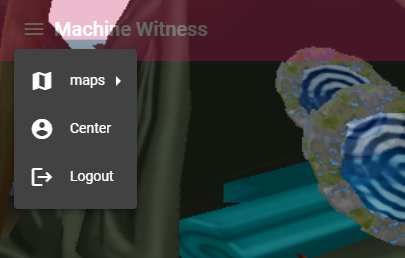
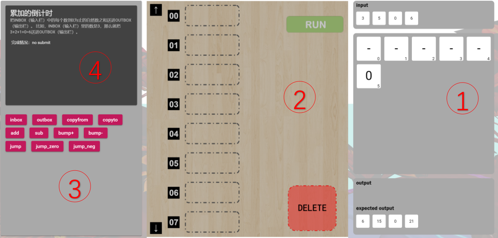
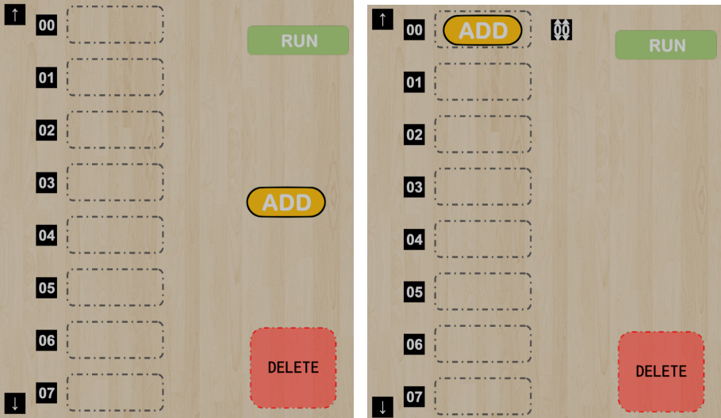
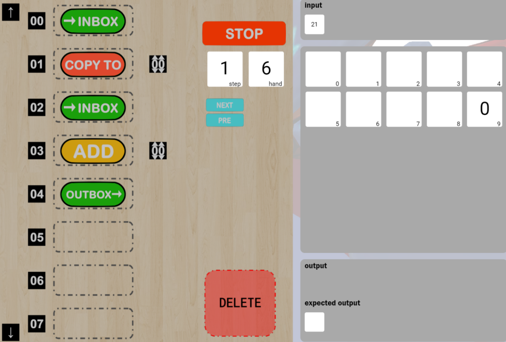
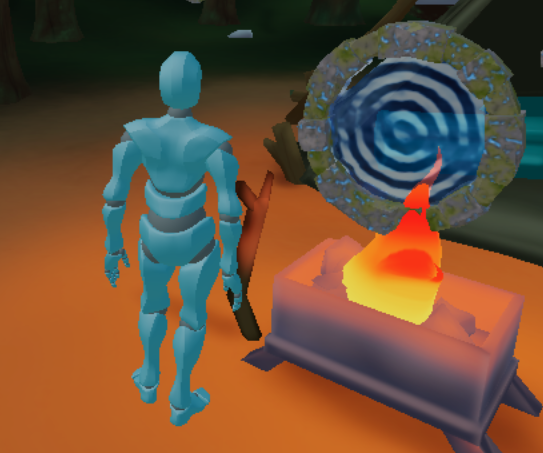
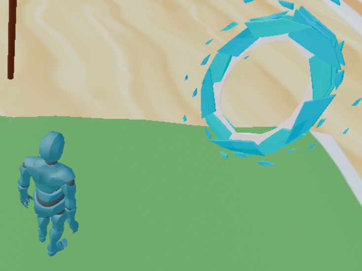
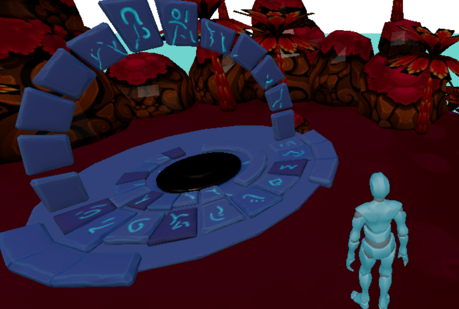
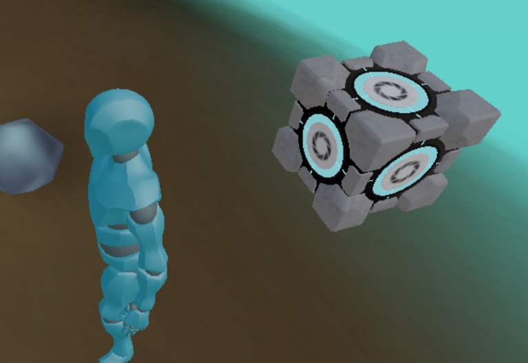
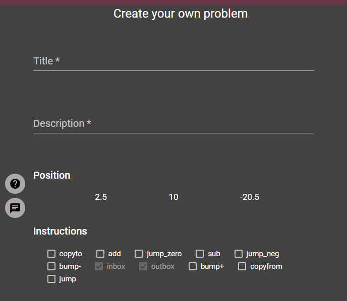
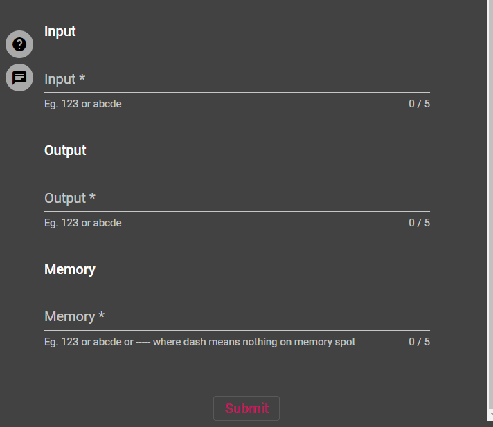

# 操作说明文档

## 注册登录

在登陆时如果使用管理员身份登录：

- 用户名 admin
- 密码 password

进行登录，会自动跳转到管理员的图表界面中。

如果使用自己注册的账号登陆，则跳转到第一个地图界面

## 导航栏

上面这个导航栏可以让用户选择地图、进入个人中心。

侧边栏可以让用户查看手册、聊天室、编辑新问题。

## 问题界面

### 问题界面操作说明

1. 问题信息，自上而下分别是问题标题，问题描述和答题情况
2. 可用的指令集，在这里点击指令集可以在操作界面添加对应的指令
3. 操作界面，见下
4. 初始条件/解题步骤，显示了每个题目的初始条件，提交答案后可以查看每执行一步输入输出和内存的变化

### 操作界面

在②中点击添加指令后可以对指令进行拖动，拖动到对应行数将会固定住，并且如果指令有操作目标（如读写内存或跳转）会在后面出现目标一个可修改的二位数作为目标指向。

- 将指令拖入DELETE框内可以删除

- 左上角和左下角的上下可以翻页，一次翻一行，最多50行

### 问题运行

点击RUN提交答案，提交完之后无法修改，并且会开始执行，点击NEXT和PRE查看每一步输入输出和内存状态的变化，点击STOP之后可以修改答案。

## 地图探索

在用户探索时会遇到一些问题传送门：

- camp

  

- island

  

- forest

  

- 其他用户自定义的问题

  

在靠近时会跳出提示框，用户可以查看问题的以往解题信息，并选择是否要进入游玩。

## 自定义问题

用户填入标题、描述，组件会自动监控用户在地图中的位置，并且用户要选择哪些指令可以使用。

用户给出输入、期待的输出以及内存情况。这里我们限制三个序列的长度均最大为5。如果内存的某个值为“-”，表示这个内存位置初始没有东西

